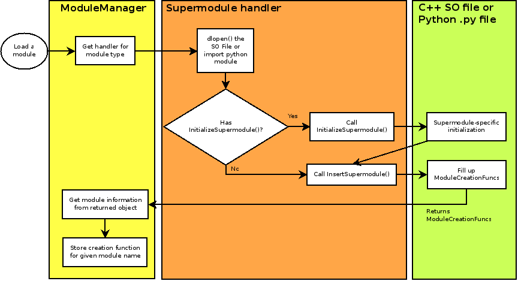

# Details of Modules and Module Loading                   {#moduledetails}

## Outline of Module Handling

Loading a module requires loading the supermodule and obtaining information for
all the modules contained in the supermodule. The information for the desired module
is then located and stored in the internal map of the ModuleManager.

The ModuleManager uses separate handlers for different types of modules
(currently, C++ and Python modules). These are responsible for the details
of working with the modules (such as calling dlopen() or importing a
python package). The supermodule itself is responsible for populating
a ModuleCreationFuncs object with information about its modules. 

Creating (instantiating) a module requires looking up the module creation
function and calling it, returning a new module, wrapped in a smart pointer.
Within the C++ SO file or the python module package, the module class's constructor
is called. This is handled within the ModuleCreationFuncs object that is returned
by InsertSupermodule.

